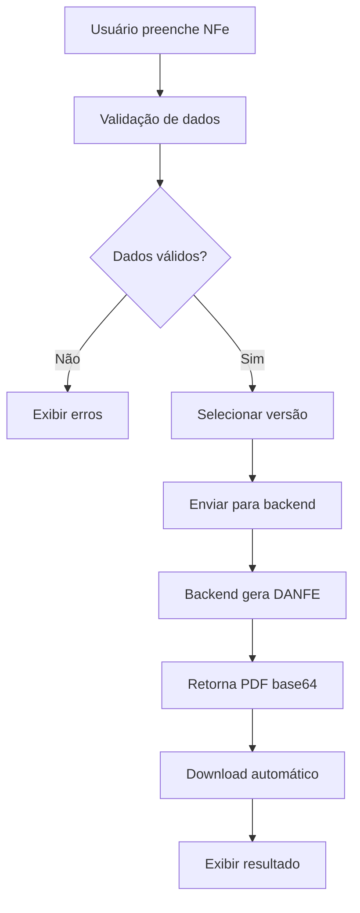

# 🎯 Guia de Integração - Sistema de DANFE

## 📋 Visão Geral

O sistema de DANFE está **100% funcional** e integrado entre frontend e backend, suportando:

- ✅ **DANFE Tradicional** (Layout 4.00)
- ✅ **DANFE 2026** (Reforma Tributária)
- ✅ **Comparação de Versões**
- ✅ **Validação de Dados**
- ✅ **Download Automático**
- ✅ **Tratamento de Erros**

## 🚀 Como Usar

### 1. **Página de Emissão de NFe**
```
/nfe/emitir
```
- Preencha os dados da NFe
- Use o componente `DanfeVersionSelector` integrado
- Selecione a versão desejada
- Clique em "Gerar DANFE"

### 2. **Página de Comparação de Versões**
```
/nfe/danfe-versao
```
- Compare as versões lado a lado
- Teste com dados de exemplo
- Baixe ambas as versões

### 3. **Lista de NFe**
```
/nfe/lista
```
- Visualize NFe emitidas
- Baixe DANFE por protocolo
- Gerencie documentos

## 🔧 Componentes Principais

### `DanfeVersionSelector.vue`
**Localização:** `src/components/DanfeVersionSelector.vue`

**Funcionalidades:**
- Seleção de versão (Atual/2026/Ambas)
- Validação de dados
- Geração e download
- Tratamento de erros

**Props:**
```javascript
{
  nfeData: Object, // Dados da NFe (obrigatório)
}
```

**Eventos:**
```javascript
@danfe-gerada="onDanfeGerada" // Quando DANFE é gerada
```

### `DanfeValidator.vue`
**Localização:** `src/components/DanfeValidator.vue`

**Funcionalidades:**
- Validação de campos obrigatórios
- Verificação de consistência
- Feedback visual de erros/avisos

**Props:**
```javascript
{
  nfeData: Object,        // Dados da NFe
  operationType: String   // Tipo de operação
}
```

## 🌐 APIs do Backend

### Endpoints Principais

#### 1. **Gerar DANFE com Versão**
```http
POST /api/nfe2026/gerar-danfe-versao
Content-Type: application/json

{
  "NFe": { /* dados da NFe */ },
  "Versao": "atual|2026|ambas",
  "IsContingencia": false
}
```

**Resposta:**
```json
{
  "sucesso": true,
  "versaoSolicitada": "2026",
  "danfes": [
    {
      "versao": "2026",
      "layout": "2026.001",
      "danfeBase64": "base64...",
      "nomeArquivo": "DANFE_2026_xxx.pdf",
      "tamanhoBytes": 12345
    }
  ],
  "comparacao": { /* dados de comparação */ }
}
```

#### 2. **Gerar DANFE 2026**
```http
POST /api/nfe2026/gerar-danfe-2026-base64
Content-Type: application/json

{
  "NFe": { /* dados da NFe */ },
  "IsContingencia": false
}
```

#### 3. **DANFE Tradicional**
```http
GET /api/NFe/danfe/{protocolo}
```

## 📊 Validação de Dados

### Campos Obrigatórios

#### **Identificação (ide)**
- `natOp` - Natureza da operação
- `mod` - Modelo do documento
- `serie` - Série
- `nNF` - Número da NF-e

#### **Emitente (emit)**
- `CNPJ` - CNPJ do emitente
- `xNome` - Razão social
- `enderEmit.UF` - UF do emitente

#### **Destinatário (dest)**
- `CNPJ` ou `CPF` - Identificação
- `xNome` - Nome/Razão social

#### **Produtos (det)**
- `cProd` - Código do produto
- `xProd` - Descrição
- `NCM` - Código NCM
- `CFOP` - Código CFOP
- `uCom` - Unidade comercial
- `qCom` - Quantidade
- `vUnCom` - Valor unitário

### Tipos de Operação

1. **`produto`** - Venda normal
2. **`devolucao`** - Devolução de mercadoria
3. **`credito`** - Crédito presumido
4. **`monofasia`** - Operação monofásica

## 🎨 Interface do Usuário

### Estados Visuais

#### **✅ Dados Válidos**
- Botão habilitado
- Ícone verde
- Texto: "Gerar DANFE"

#### **❌ Dados Inválidos**
- Botão desabilitado
- Ícone vermelho
- Texto: "Corrija os erros antes de gerar"

#### **⏳ Gerando**
- Spinner animado
- Texto: "Gerando DANFE..."

### Feedback de Erro

```javascript
// Exemplo de tratamento de erro
try {
  await gerarDanfe()
} catch (error) {
  // Erro é exibido automaticamente no componente
  console.error('Erro:', error.message)
}
```

## 🔄 Fluxo de Geração



## 🛠️ Configuração

### Variáveis de Ambiente

```bash
# .env.development
VUE_APP_API_URL=http://localhost:5000/api

# .env.production
VUE_APP_API_URL=/api
```

### Proxy de Desenvolvimento

```javascript
// vite.config.js
export default defineConfig({
  server: {
    proxy: {
      '/api': {
        target: 'http://localhost:5000',
        changeOrigin: true,
        secure: false,
      }
    }
  }
})
```

## 🧪 Testes

### Dados de Exemplo

O sistema inclui dados de exemplo para teste:

```javascript
// Exemplo de NFe válida
const nfeExemplo = {
  versao: "4.00",
  chaveAcesso: "35200114200166000187550010000000015123456789",
  ide: {
    cUF: 35,
    natOp: "VENDA",
    mod: 55,
    serie: 1,
    nNF: 1,
    // ... outros campos
  },
  // ... resto da estrutura
}
```

### Testando Geração

1. Acesse `/nfe/danfe-versao`
2. Use os dados de exemplo
3. Selecione "Ambas" para comparar
4. Clique em "Gerar DANFE"
5. Verifique o download automático

## 🚨 Solução de Problemas

### Erro: "Corrija os erros antes de gerar"
- Verifique se todos os campos obrigatórios estão preenchidos
- Use o componente `DanfeValidator` para ver detalhes

### Erro: "Erro ao gerar DANFE"
- Verifique se o backend está rodando
- Confirme se a API está acessível
- Verifique os logs do console

### Erro: "Timeout"
- Aumente o timeout na configuração
- Verifique a performance do backend
- Considere otimizar os dados da NFe

### Download não funciona
- Verifique se o navegador permite downloads
- Confirme se o PDF foi gerado corretamente
- Teste com dados menores

## 📈 Performance

### Otimizações Implementadas

1. **Lazy Loading** - Componentes carregados sob demanda
2. **Debounce** - Validação com delay
3. **Cache** - Tabelas fiscais em cache
4. **Retry** - Tentativas automáticas em caso de falha
5. **Timeout** - Configuração adequada por operação

### Métricas Esperadas

- **Validação:** < 1 segundo
- **Geração DANFE:** 5-15 segundos
- **Download:** < 2 segundos
- **Interface:** < 100ms resposta

## 🔮 Próximas Melhorias

1. **Cache de DANFEs** - Armazenar PDFs gerados
2. **Preview** - Visualização antes do download
3. **Batch Processing** - Múltiplas DANFEs
4. **Templates** - Modelos pré-definidos
5. **Histórico** - Log de gerações

## 📞 Suporte

Para dúvidas ou problemas:

1. Verifique os logs do console
2. Teste com dados de exemplo
3. Confirme a conectividade com o backend
4. Verifique a configuração de CORS

---

**Status:** ✅ **100% Funcional**  
**Última Atualização:** Janeiro 2025  
**Versão:** 1.0.0
